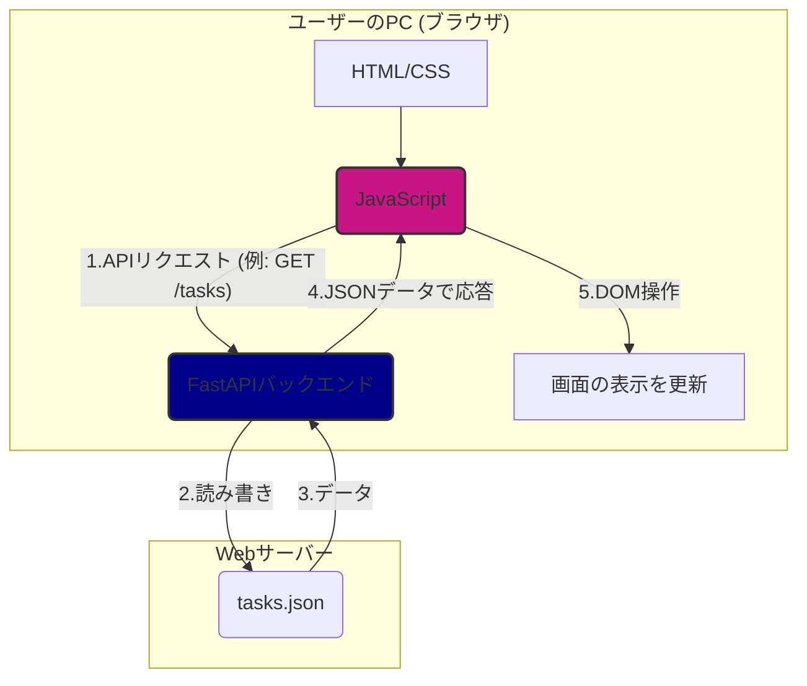

# ToDoListApp WebApp

## 概要

このプロジェクトは、以前FastAPIで開発した[ToDoListApp_API](https://github.com/qack-dev/ToDoListApp_API)に、ユーザーがブラウザから直接操作できる**フロントエンドUI**を追加し、完全なWebアプリケーションとして昇華させたものです。

バックエンドAPIとフロントエンド（HTML/CSS/JavaScript）が連携して動作する、モダンなWebアプリケーションの基本構成を実践しています。

## アーキテクチャ

ユーザーのブラウザで動作するフロントエンドと、サーバー上でデータを処理するバックエンドが、APIを介して通信します。



## 主な機能

*   ブラウザ上でのタスク一覧のリアルタイム表示
*   入力フォームからの新しいタスクの追加
*   入力フォームからの既存タスクの削除

## 技術スタック

*   **Backend**: Python, FastAPI
*   **Frontend**: HTML, CSS, JavaScript (Vanilla JS)
*   **Server**: Uvicorn

## セットアップと実行方法

### 1. 環境構築

```bash
# 1. このリポジトリをクローンします
git clone https://github.com/qack-dev/ToDoListApp_WebApp.git
cd ToDoListApp_WebApp

# 2. Pythonの仮想環境を作成し、有効化します
python -m venv env
# Windowsの場合
.\env\Scripts\activate
# macOS/Linuxの場合
# source env/bin/activate

# 3. 必要なライブラリをインストールします
# (backendディレクトリに移動してからインストールするのがおすすめです)
cd backend
pip install fastapi uvicorn
```

### 2. APIサーバーの起動

**`backend`ディレクトリ内**で、以下のコマンドを実行してください。

```bash
# 現在地が ToDoListApp_WebApp/backend であることを確認してください
uvicorn main:app --reload
```

`--reload`オプションにより、`main.py`を変更するとサーバーが自動で再起動します。

## 使い方

サーバー起動後、お使いのWebブラウザで以下のURLにアクセスしてください。

**`http://127.0.0.1:8000/static/index.html`**

表示されたWebページ上から、タスクの確認、追加、削除が直感的に行えます。

## ファイル構造

```text
.
├── backend/         # バックエンド関連のファイルを格納
│   ├── main.py      # FastAPIアプリケーションの本体
│   └── tasks.json   # タスクデータが保存されるファイル
└── frontend/        # フロントエンド関連のファイルを格納
    └── static/
        ├── index.html   # ユーザーが見る画面の骨格
        ├── style.css    # 見た目を整えるファイル
        └── script.js    # API連携や動きを制御するファイル
```
